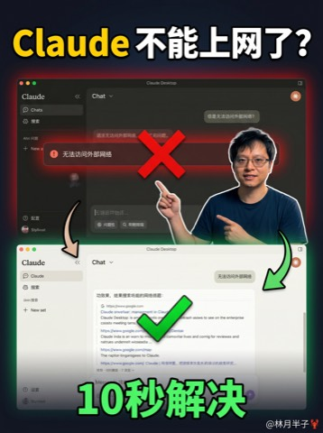
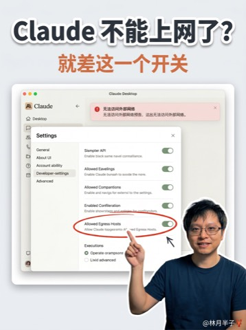
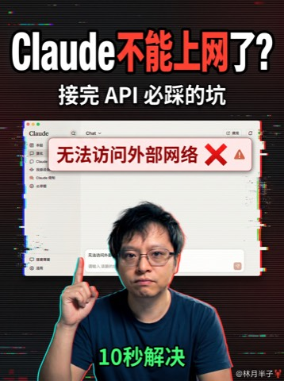

# short-video-cover

短视频封面图生成 skill(3:4 竖版),适用于视频号/抖音/小红书。

## 这个 skill 解决什么问题

每次发短视频都要重新做封面太麻烦,这个 skill 把"短视频封面爆款规律"固化成模板,**根据视频口播文案一键生成符合品牌一致性的 3:4 竖版封面**。

## 适用范围

本 skill 只处理 **3:4 竖版短视频封面**，用于视频号/抖音/小红书等平台的短视频缩略图。公众号宽幅题图、朋友圈九宫格、头像、海报等不在本 skill 范围内。

## Preview Gallery(11 种风格)

同一主题(「Claude 不能上网了?· 10 秒解决」)批量实测的效果,点风格名可看完整提示词模板:

| | | |
|:---:|:---:|:---:|
|  |  |  |
| 1 [深色科技标题风](references/styles/dark-tech-title.md)<br>默认安全牌 | 2 [明亮 YouTuber 风](references/styles/bright-youtuber.md)<br>科普/破圈内容 | 3 [双屏对比叙事风](references/styles/split-screen-narrative.md)<br>避坑/报错修复 |
|  |  |  |
| 4 [产品主视觉风](references/styles/product-hero.md)<br>工具测评/软件教程 | 5 [拼贴信息飓风](references/styles/collage-info-storm.md)<br>工作流/多工具组合 | 6 [工作台场景风](references/styles/workspace-scene.md)<br>Vlog 式教程/设备评测 |
|  |  |  |
| 7 [故障警示风](references/styles/glitch-warning.md)<br>Bug 排查/安全提醒 | 8 [Agent 号召风](references/styles/agent-hype.md)<br>AI 工具推荐/Agent 概念 | 9 [卡片展示人设风](references/styles/card-showcase.md)<br>工具合集/技巧盘点 |
|  |  | |
| 10 [萌宠代码风](references/styles/cute-mascot.md)<br>轻松入门/趣味编程 | 11 [手持设备展示风](references/styles/device-showcase.md)<br>网页/App/作品展示 | |

## 文件结构

```
ai-teaching-media/short-video-cover/
├── SKILL.md                              # 主入口,Claude 读这个
├── README.md                             # 本文件
├── references/
│   ├── brand_baseline.md                 # 全风格通用品牌基线与填空指引
│   ├── style_catalog.md                  # 风格目录索引(只负责选风格)
│   ├── styles/                           # 11 种风格的完整提示词模板
│   │   ├── dark-tech-title.md
│   │   ├── bright-youtuber.md
│   │   ├── split-screen-narrative.md
│   │   ├── product-hero.md
│   │   ├── collage-info-storm.md
│   │   ├── workspace-scene.md
│   │   ├── glitch-warning.md
│   │   ├── agent-hype.md
│   │   ├── card-showcase.md
│   │   ├── cute-mascot.md
│   │   └── device-showcase.md
│   ├── examples.md                       # 已验证案例(含完整可跑提示词)
│   └── host_ref_face.png                   # 默认主持人参考图(当前维护者形象,可替换)
├── assets/previews/                      # 11 种风格的压缩预览图(README 画廊用)
└── .gitignore                            # 排除生成产物(covers/、demo-cases/outputs/)
```

生成的封面图统一输出到**当前工作目录**下的 `./video-covers/`,不落在 skill 目录里。skill 内的 `covers/` 和 `demo-cases/outputs/` 是历史生成产物,已被 .gitignore 排除,不进 git。

## 快速开始

### 1. 设置 API Key

```bash
export MULERUN_API_KEY=sk-xxx
```

### 2. 直接跑一个已验证案例

```bash
python ../ai-image-generator/scripts/generate.py \
  --mode edit \
  --prompt-file references/examples.md \
  --image "references/host_ref_face.png" \
  --aspect-ratio 3:4 \
  --output-dir ./video-covers \
  --name-tag claude-no-internet
```

(注意:实际使用时要把 examples.md 里"完整示例 1"那段提示词单独抽出来存成 .txt)

### 3. 让 Claude 直接生成

让 Claude 调用这个 skill,按"读懂口播 → 提炼素材 → 填模板 → 调 API"的流程一步到位。

## 核心设计原则

### 1. 先选风格,再填内容

生成封面前先让用户从 11 种风格里选一种,默认走「深色科技标题风」。不同风格的背景、人物比例、标题处理方式差异很大,不要混用。

风格目录见 `references/style_catalog.md`，具体模板见 `references/styles/{风格}.md`，品牌基线见 `references/brand_baseline.md`。

### 2. 主标题必须是"人话"

短视频封面是给**滑动到这条视频但还没看的陌生人**看的。他们大概率不懂技术行话。

判断标准:**"这句话能不能让我妈秒懂?"**

例子:
- ❌ "接了 API 不能联网?" → 行话
- ✅ "Claude 不能上网了?" → 人话

### 3. 表情固定为"自信微笑、看镜头"

绝不用震惊体表情。理由:host 的人设是"踏实分享干货",不是"标题党博主",长期用震惊表情会损耗粉丝信任。

### 4. UI 元素必须是"问题 → 解决"双截图叙事

单一截图不够爆款。爆款短视频封面都在讲故事:
- 主元素:**问题状态**(红色报错截图)
- 辅助元素:**解决状态**(绿色对勾截图)
- 用箭头连接,讲清楚视频要解决什么

### 5. 品牌基线不变,风格和内容可变

不变的:本地 host 人物参考图(`references/host_ref_face.png`) + 3:4 竖版 + 标题人话 + 自信微笑看镜头 + 右下角水印

可变的:具体风格 / 背景色调 / 标题配色 / 人物比例 / UI 截图内容 / 报错文案

## 常见问题

**Q: 为啥 API 走 3:4 而不是 9:16?**
A: 视频号/抖音的封面在缩略图位置实际显示是 3:4(不是 9:16),9:16 在缩略图会被上下裁切。3:4 是缩略图的"原生比例",显示最完整。

**Q: 生成的图能直接发吗?**
A: 大概率能。但 AI 对中文细节渲染偶尔翻车,**关键文字(主标题/副标题)如果糊了,建议用 Figma/PS 后期覆盖一遍**。提示词里已经强调了文字精确渲染,但保险起见。

**Q: 想换其他平台用怎么办?**
A: 小红书图文笔记是 3:4(本 skill 直接适用)、视频号竖版视频缩略图是 3:4(本 skill 直接适用)。如果要做横版的(B 站/YouTube),改 `ASPECT_RATIO = "16:9"` 即可,但布局可能要重新调。

## 维护说明

- 每次生成的图都会同时保存 `.png`、`.txt`(提示词)、`.json`(API 元数据)三个文件,方便复盘和重跑
- 如果某次的提示词跑出来效果特别好,把它加到 `references/examples.md` 当新案例
- 视觉基线如果要调整(换衣服颜色、换字体配色等),改 `references/brand_baseline.md`
- 新增风格时,在 `references/styles/` 新建一个 `{style-slug}.md`,并在 `references/style_catalog.md` 和 `SKILL.md` 里同步更新风格表
