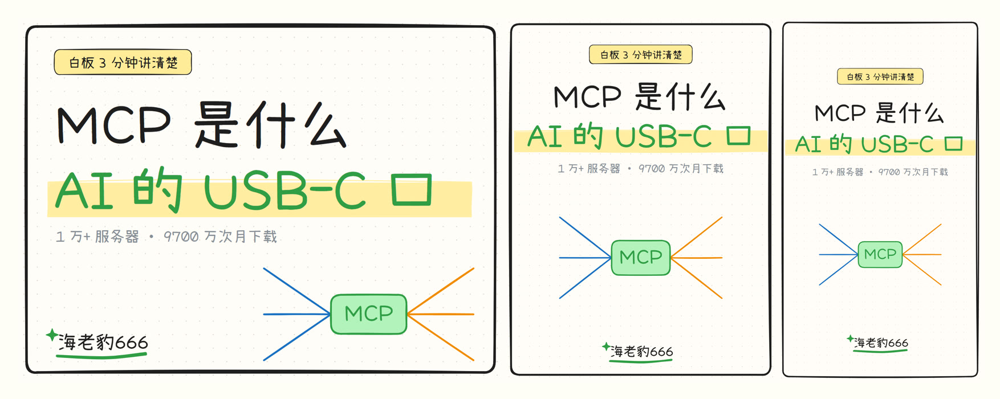

# whiteboard-video-factory：手绘白板讲解视频工厂

> [skills_collection](../../README.md) 合集的一部分。

**手绘白板风格的"边画边讲"讲解视频**，以 AI skill 的形式开源。给智能体一句选题，它查资料、写旁白、画场景、配音对字幕、逐笔渲染、混配乐，交回四样东西：一条 1080p 成片、三张封面（4:3 横版 / 3:4 竖版 / 9:16 抖音竖屏）、一份写好五个候选标题和各平台文案（视频号 / 小红书 / 抖音 / B 站 / 公众号）的发布稿、一份资料来源。**时长不限**：2 分钟的科普短片到 30 分钟的深度长片都支持，长短只由场景数决定，不写死在配置里。

不露脸，不开剪辑软件，画面上每一笔都是代码画的。

> **本仓库由 `whiteboard-video` 与 `video-common` 两个 skill 合并而成**：白板出片流水线 + 原本散在公共工序里的事实核查、合规自查、成片机器与目视验收、交付边界。合并后自成一体，装这一个目录就能跑，不再需要并列安装 `video-common`。

## 先看样片

样片就是仓库里的示例期 **《MCP 是什么》**——讲 AI 工具为什么都在接同一个协议。

**▶️ [assets/sample-preview.mp4](assets/sample-preview.mp4)**（成片前 40 秒，点进去在 GitHub 页面里直接播放）。完整示例工程在 `examples/`，一条命令就能在你电脑上重新渲染出来。


字幕带**跟读高亮**：念到哪一段，那一段字背后就套一个品牌色圆角块、字转反白（`config.json` 的 `captions.highlight` 可关、可换色、可调粒度）：


封面由同一个函数按画幅一次出，三张一条命令一起产出：



样片和封面里的「海老豹666」取自 `config.json` 的 `brand.name`，改这一处就换成你的。

## 它是怎么做的

```
选题 → 查证（数字进 README）→ 写旁白（按 | 切段）→ 出 Logo 与贴纸 → 画场景（逐段静帧检查）
    → TTS 配音（火山逐字时间戳 / 小米静音估算，都对字幕）→ 浏览器里逐笔渲染 → 混配乐 → 封面 → 发布文案
```

| 环节 | 用什么 |
| --- | --- |
| 手绘线条 | [rough.js](https://roughjs.com/)（Excalidraw 底层同一个库），场景同时导出 Excalidraw 格式，装了 Obsidian Excalidraw 插件能直接打开改 |
| 逐笔动画 | Playwright 在 Chromium 里逐帧截图，4 路并行；参考值 2.5 分钟的片子渲染约 35 秒，本机实测约 44 帧/秒（**渲染按场景分段做，场景数不限，所以长片只是线性变慢**） |
| 人物、道具贴纸 | 本地 [codex](https://github.com/openai/codex) CLI 生图，一次 2×2 四宫格，自动抠白底、去杂点 |
| 公司、产品 Logo | Wikimedia Commons 官方 SVG，出处自动记录 |
| 配音与字幕 | 三条通道任选：**火山引擎**（豆包，`seed-tts-2.0` 官方音色或你自己的声音复刻，返回**逐字时间戳**直接对字幕，默认用它）/ **小米 MiMo**（`mimo-v2.5-tts`，九个音色；接口没有语速参数也没有时间戳，语速走本地 `atempo`、时间轴用静音检测估算）/ **edge-tts**（免费、无需凭证，本地备胎）。都在 `config.json` 的 `tts.engine` 切换 |
| 合成 | ffmpeg：拼帧、烧字幕、说话时自动压低配乐；配乐可单曲循环，也可多首（`bgm.playlist`）按序拼成一整段再循环——**长片靠它避免同一首曲子循环十几次** |
| 字幕跟读高亮 | 语音念到哪一段，那一段字背后就套一个品牌色圆角块、字转反白（卡拉OK式跟读）。分段**按字数**控制（默认每段 2~4 字、目标 3 字），切点避开英文单词（不把 `MiMo` 拦腰截断），标点不进色块。开关、颜色、粒度都在 `config.json` 的 `captions.highlight`，火山 / 小米 / edge **三个引擎通用**——火山用原生逐字时间戳，小米用静音估算的时间轴按字数等比拆；`wb captions <期>` 可打印每段的切分 |

几条写死在 skill 里的规矩：

- **先写旁白，再决定画什么。** 每一段都得有东西能画，画不出来的句子并进相邻段。
- **字幕区和水印区是禁区。** 底部 y≥960 留给字幕，右上角 320×130 留给水印，元素压进去就报警告。
- **讲公司用官方 Logo，讲人用照片参考的漫画像。** AI 画的拟人机器人和通用小人，观众认不出是谁。
- **数字先查再写。** 出处和口径进期目录 README，旁白、字幕、封面、文案里的数字从同一处取。
- **每期都一样的东西进配置文件。** 语速、配乐音量、字幕字号、品牌名都在 `config.json`，AI 只写每期不一样的部分。
- **时长不写死。** 成片长度由场景数决定（约 1 分钟 ≈ 1.5~2 个场景 ≈ 200 字），2 分钟到 30 分钟都走同一条流水线；>5 分钟要分幕、加呼吸点、把配乐换成播放列表——细则见 `SKILL.md` 的「做长片」。

## 仓库内容

| 路径 | 说明 |
| --- | --- |
| `SKILL.md` | 技能入口，AI 读这个 |
| `references/dsl.md` | 场景与封面 API（一行代码一个元素） |
| `references/scene-patterns.md` | 版式坐标套路，可直接抄 |
| `references/stickers.md` | 贴纸、真实 Logo、真人漫画像 |
| `references/publish.md` | 标题公式、各平台规格与机制、抖音怎么写 |
| `references/fact-check.md` | 事实核查与来源台账 |
| `references/compliance.md` | 发布前合规自查 |
| `references/delivery-qa.md` | 成片机器与目视验收、封面验收、交付边界 |
| `references/voices-volc.md` | 火山 TTS 的两个调用域、resourceId 与音色怎么配套、实测可用音色、报错速查 |
| `references/voices-mi.md` | 小米 MiMo TTS：端点与 assistant 角色规矩、无语速参数、无时间戳怎么对齐、九个实测音色、三条通道怎么选 |
| `bin/wb` | 命令行：`new` `scenes` `stills` `image` `logo` `tts` `voice` `captions` `render` `mix` `cover` `build` `clean` |
| `lib/scene-dsl.js` | 场景 DSL：一行代码一个元素，导出 Excalidraw 场景图、旁白稿、封面 |
| `lib/render.html` `lib/render.js` | 逐笔渲染器：子路径顺序描边、双描边 A/B 层、按字数排期、铅笔跟随、并行出帧；字幕按高亮段排成多个 `tspan`，用 `getExtentOfChar` 量出当前段宽度，在字下画品牌色圆角块做跟读高亮 |
| `lib/tts-volc.mjs` `lib/tts/` | 旁白驱动器 + 三条引擎实现（火山 / 小米 MiMo / edge），带缓存与半段音频自动重试；火山自动区分 `standard` / `plan` 调用域 |
| `lib/tts-check.mjs` | `wb voice` 自检：回显引擎/端点/模型/音色，真跑一句确认配套 |
| `lib/tts/mi.mjs` | 小米 MiMo 通道：`/chat/completions` + assistant 角色、`atempo` 变速、静音检测估算句子时间 |
| `lib/tts-edge.py` | edge-tts 备胎通道，输出与火山同格式的逐字时间戳 |
| `lib/captions.cjs` | 逐字时间戳切 6~20 字短句，再按 2~4 字拆成**跟读高亮段**（`wordsToUnits` 把 TTS 词表对齐回原文、`normalizeUnits` 做目标 3 字贪心分组），烧录并导出纯文本 SRT；`wb captions <期>` 打印每段切分 |
| `lib/gen-image.mjs` | codex 生图贴纸 + 抠图 |
| `lib/fetch-logo.mjs` | Wikimedia Commons 官方 Logo，`--vs` 拼对比封面图 |
| `lib/mix-bgm.mjs` | 闪避配乐：说话时压低，停顿时抬起，尾部淡出；支持单曲循环（`bgm.file`）与多首播放列表（`bgm.playlist`，按序拼成一整段再循环，长片用） |
| `templates/` | 每期 `scenes.js` 与 `发布.md` 模板 |
| `examples/` | 一期完整示例《MCP 是什么》：旁白、7 个场景 22 个 beat、三画幅封面函数、资料来源、发布稿（本期没用 AI 贴纸，画面全部由 `scenes.js` 里的 Excalidraw 图元绘制） |
| `config.json` | 全部参数：目录、语速、配乐、笔速、字幕、品牌层、封面 |

## 环境

| 依赖 | 说明 |
| --- | --- |
| Node.js 20.12 以上 | 用到了 `process.loadEnvFile` |
| ffmpeg | `brew install ffmpeg` / 官网装 Windows 版 |
| Playwright Chromium | `npm install` 会自动装（装不上见 SKILL.md 的「跨平台说明」） |
| codex CLI | 只有出贴纸（`wb image`）用到，登录后走你自己的额度 |
| 火山引擎账号 | 可选。开通语音合成，凭证填 `.env`；想用自己的声音就在控制台做一次声音复刻。**没有凭证就把 `tts.engine` 改成 `edge`，走 edge-tts 免费出片**（需要一个装好 `edge_tts` 的 Python，填在 `tts.edge.python`） |
| 小米 MiMo 账号 | 可选。`tts.engine` 改成 `mi` 时用，凭证是 token-plan 的 `tp-` 开头 Key，填 `.env` 的 `MI_TTS_API_KEY`。音色固定九个，见 `references/voices-mi.md` |

> 火山有两个互不相通的调用域：控制台发的 `ark-` 开头 **API Key 只走 `plan` 域**，直购/旧版凭证走 `standard` 域（打错域报 `45000010 Invalid X-Api-Key`，看着像没额度其实不是）。`config.json` 的 `tts.endpoint` 指定，留空按 Key 前缀自动判定；配好先跑 `wb voice` 自检。详见 `references/voices-volc.md`。
>
> 小米 MiMo 的规矩与火山几乎处处不同：正文要放在 `assistant` 角色里、**接口没有语速参数**（`tts.speed` 由本地 `atempo` 实现）、**不返回时间戳**（字幕时间用静音检测估算，实测边界误差约 0.05s）。详见 `references/voices-mi.md`。

macOS / Linux / Windows（Git Bash）都能跑，平台差异已收在工具层，详见 `SKILL.md` 的「跨平台说明」。

## 使用

```bash
# 把本目录放进 AI 工具的 skills 目录即可（Claude Code 是 ~/.claude/skills/，软链也行）
cp -R whiteboard-video-factory ~/.claude/skills/
cd ~/.claude/skills/whiteboard-video-factory
npm install
cp .env.example .env          # 填火山（或小米）凭证和音色；都没有就改 config.json 的 tts.engine 为 edge
bin/wb voice                  # 配音自检：确认"凭证 × 端点 × 音色"三者配套（失败会直接告诉你改哪一项）

# 先把示例渲染一遍，确认环境没问题
mkdir -p episodes && cp -R examples/* episodes/
bin/wb build MCP               # 约两三分钟，成片在 build/<期>/outputs/final.mp4
```

装好之后对它说：

> 做一期白板视频：为什么定了计划总是坚持不下去

它会按 `SKILL.md` 建期目录、查资料、写旁白、出贴纸、画场景，逐段出静帧给你看，最后出片、出封面、写发布稿。中途任何一步都可以停下来改。

自己动手也行：

```bash
bin/wb new "为什么定了计划总是坚持不下去"   # 建期目录，编辑里面的 scenes.js
bin/wb stills 计划                        # 每段一张静帧，检查排版
bin/wb build 计划                         # 出片
```

## 换成你的账号

- **品牌**：`config.json` → `brand.name`（水印与片尾的手写名）、`brand.accent`（品牌色）、`brand.slogan`、`brand.endCard.cta`；有透明底 logo 就填 `brand.logo`。
- **声音**：先选引擎 `tts.engine`，再用该引擎自己的音色字段——火山 `.env` 的 `VOLC_TTS_VOICE`（官方 2.0 音色配 `VOLC_TTS_RESOURCE_ID=seed-tts-2.0`，可用音色见 `references/voices-volc.md`；声音复刻音色 `S_` 开头配 `volc.megatts.default`；调用域由 `tts.endpoint` 指定）；小米 `tts.mi.voice` 或 `MI_TTS_VOICE`（只有九个，见 `references/voices-mi.md`）；edge-tts 改 `tts.edge.voice`。改完跑 `wb voice` 试听，**换引擎后必须重跑 `wb tts`**。
- **语速与音量**：`config.json` → `tts.speed`（默认 1.2 倍）、`tts.loudness`；给 2.0 音色的自然语言风格描述填 `tts.style`（小米通道下 `style` 会作为 user 消息一起发）。⚠️火山是原生变速，小米是本地 `atempo` 后处理。
- **配乐**：仓库不附带音乐。放一首无版权音乐到 `assets/bgm.mp3`，或改 `config.json` 的 `bgm.file`；没有配乐就出无配乐成片。**做长片就用 `bgm.playlist`**：`[{ "file": "assets/bgm-1.mp3" }, { "file": "assets/bgm-2.mp3", "trim": [0, 90] }]`，几首按顺序拼成一整段再整体循环，避免一首曲子循环十几次。临时换曲 `BGM=路径`、临时换列表 `BGM_PLAYLIST='[{...}]'`。
- **目录**：`config.json` → `dirs.projects` 可以指到你的 Obsidian 仓库里，每期文件夹就能在 Obsidian 里直接看、直接改场景图。
- **封面标签与画幅**：`cover.seriesTag`、`cover.ratios`（默认 4:3 / 3:4 / 9:16，不要抖音就删掉 9:16）。
- **发布文案口吻与话题**：`references/publish.md`、`templates/发布.md`。

## 许可

- 代码与文档：MIT，见合集根目录 `LICENSE`。
- `assets/fonts/Xiaolai-Regular.ttf`：[小赖字体](https://github.com/lxgw/kose-font)，SIL Open Font License 1.1，许可证见 `assets/fonts/OFL.txt`。
- `examples/` 的画面由 `scenes.js` 用 Excalidraw 图元绘制，随示例一起提供，可自由使用。
- 样片与封面里的 `MCP` 是 Anthropic 的开放协议，取其字面名称用于说明；用 `wb logo` 取到的公司 Logo 版权归各自所有者，只适合在评论和报道语境中原样使用。
